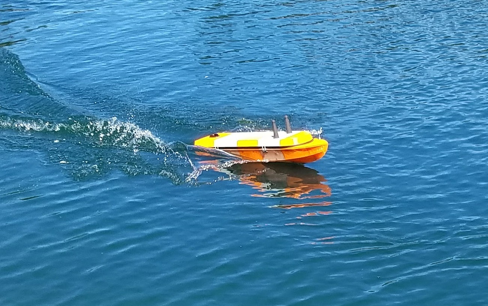
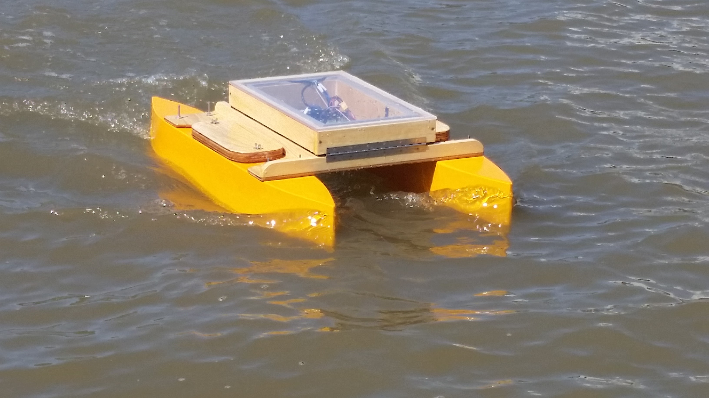

# Home Page for Data 
Cal Maritime autonomous Boats Gather Data

Most of the data will be in the geojson format, which Github can render.  

The files can be viewed by clicking the "View... on Github" link at the top.  Each file can have metadata as well stored in the github repository, if you click on the file you will see it mapped and you can read the comments or metadata.

Each vessel has its own directory

* [n3m0](../n3m0/)
* [Dumbo](../dumbo/)

